<div align="center">
  <strong></strong>

  # Alex - the Agentic Learning Equities Explainer

  _By **BINATI AInalytics**_

  [](https://aws.amazon.com/)
  [](https://nextjs.org/)
  [](https://python.org/)
  [](https://terraform.io/)

</div>

## Overview

**Alex** is a multi-agent enterprise-grade SaaS financial planning platform that provides intelligent insights on equity portfolios through AI-powered reports, charts, and retirement projections. Built on AWS serverless infrastructure, Alex demonstrates production-ready AI agent orchestration with cost-optimized architecture.

### Key Features

- **Multi-Agent Collaboration**: 6 specialized AI agents working together via intelligent orchestration
- **Real-Time Portfolio Analysis**: Comprehensive analysis of holdings, allocations, and risk exposure
- **Retirement Projections**: Monte Carlo simulations for long-term financial planning
- **Dynamic Visualizations**: Interactive charts for asset allocation, sector exposure, and regional distribution
- **Autonomous Research**: Background agent continuously gathering market intelligence
- **Enterprise Security**: Clerk authentication, API key protection, and IAM-based access control

## Screenshots

<details>
<summary>Click to view application screenshots</summary>

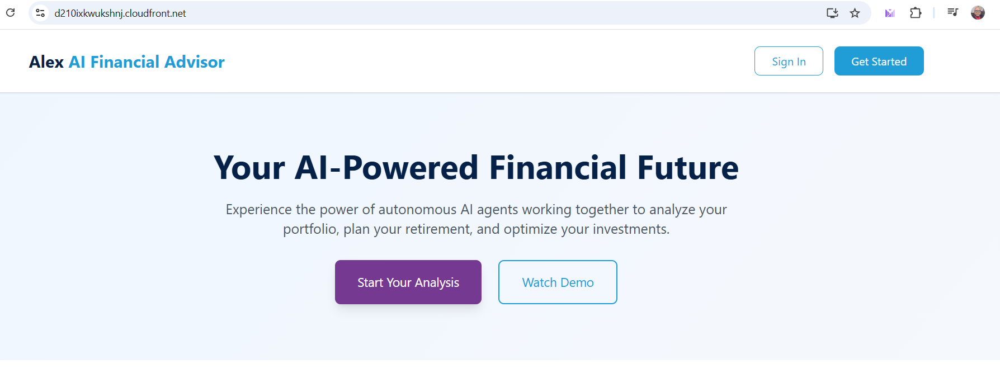
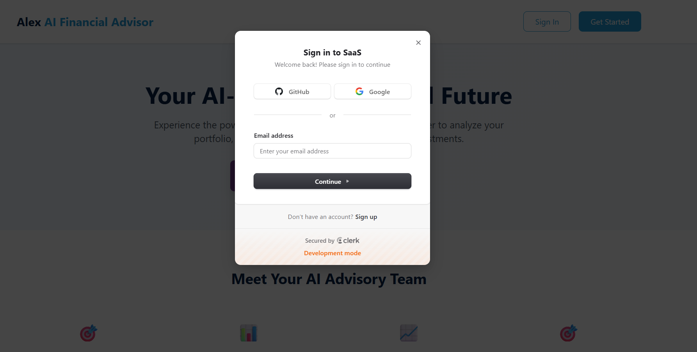
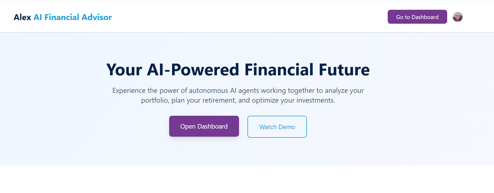
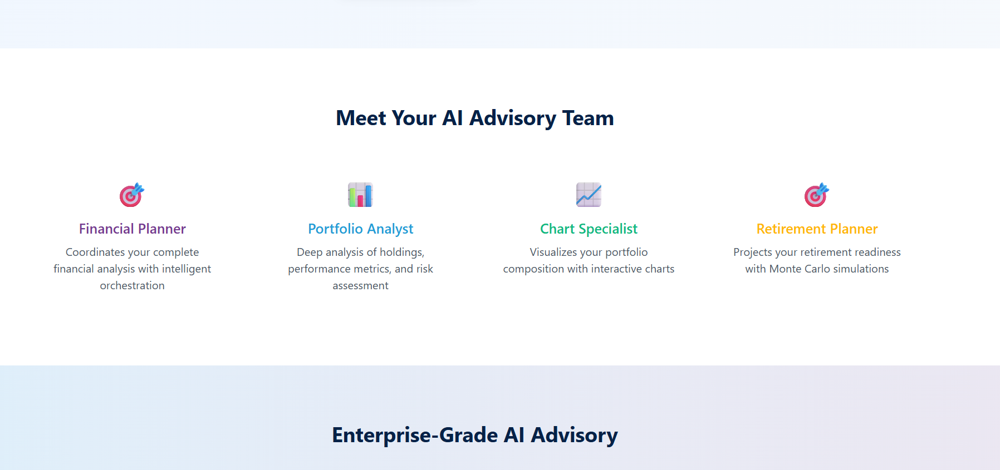

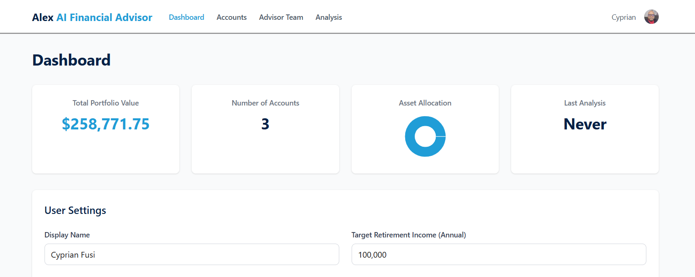
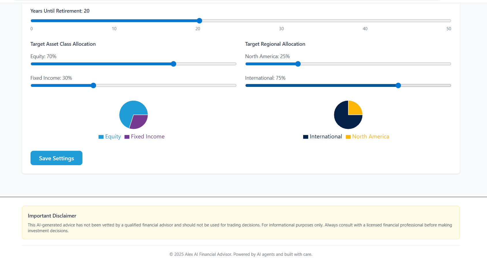
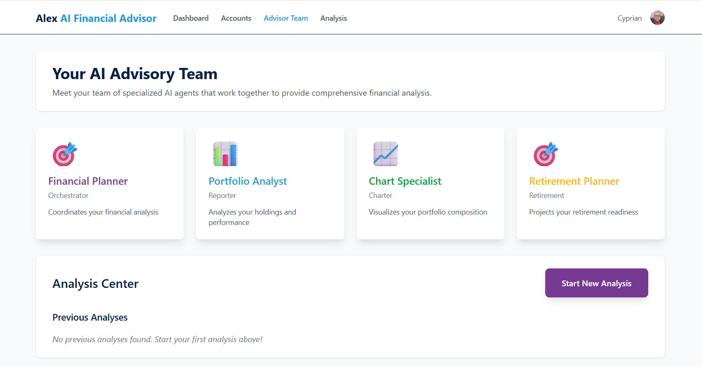

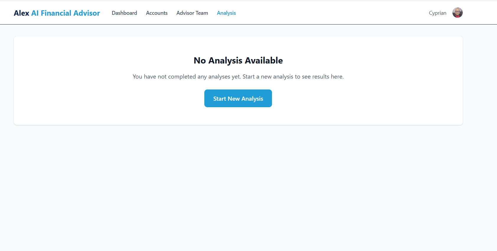
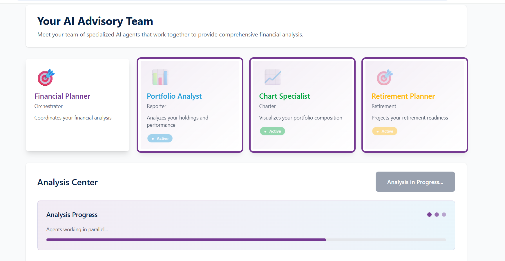
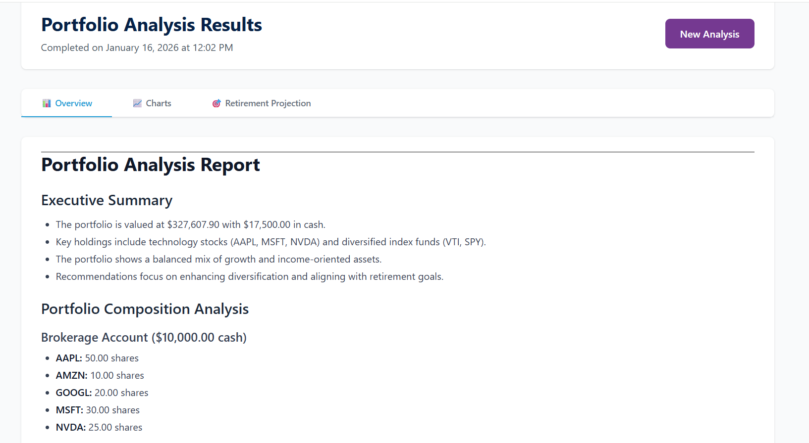
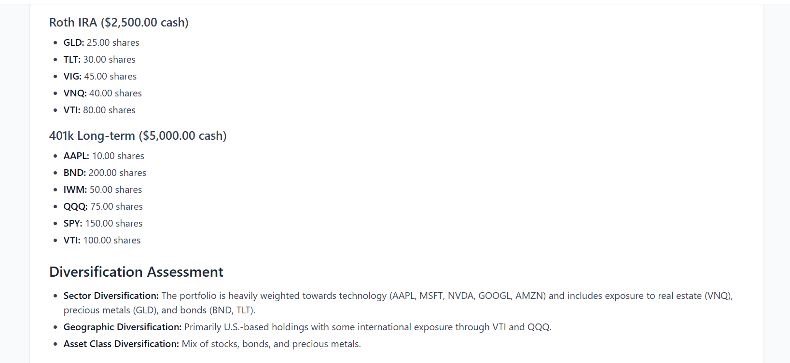
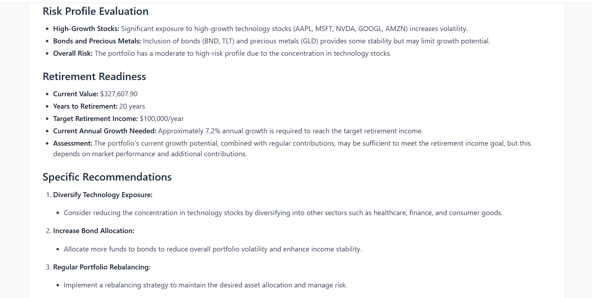
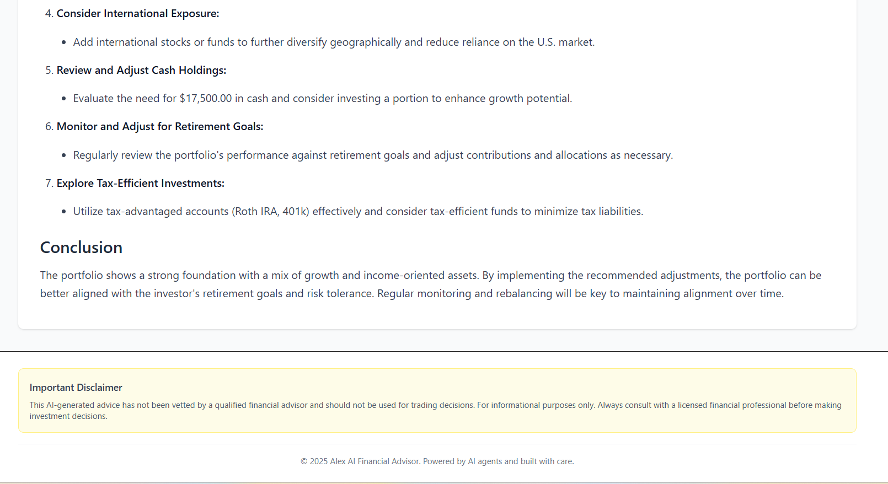
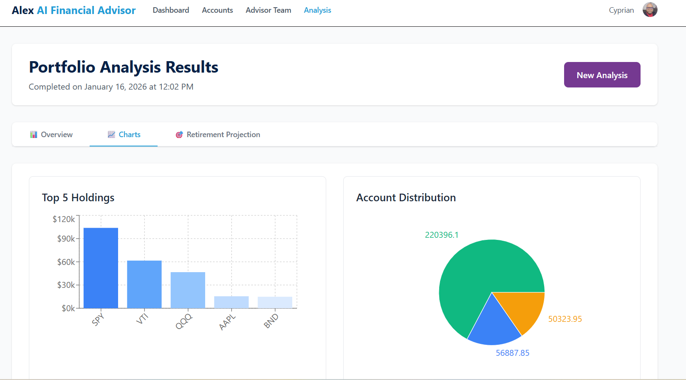
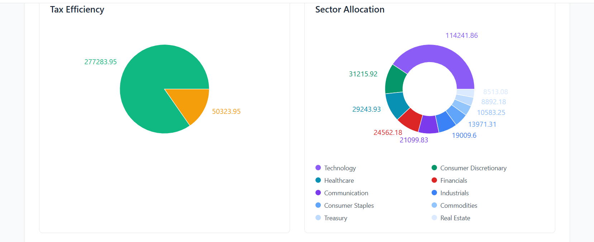
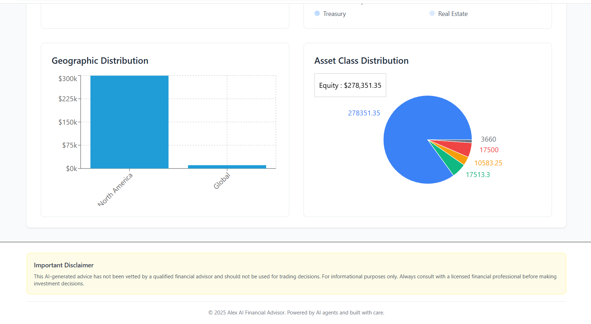
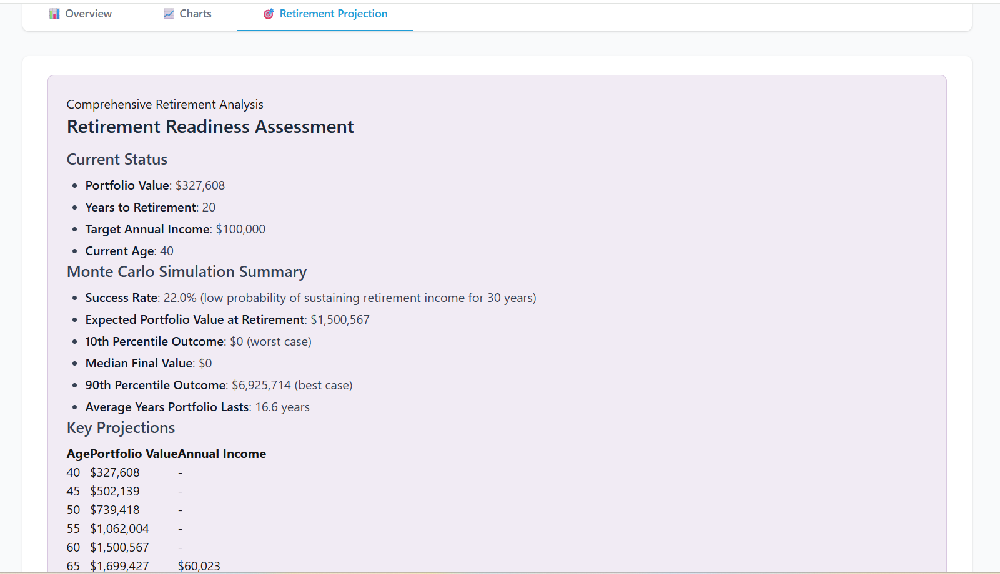
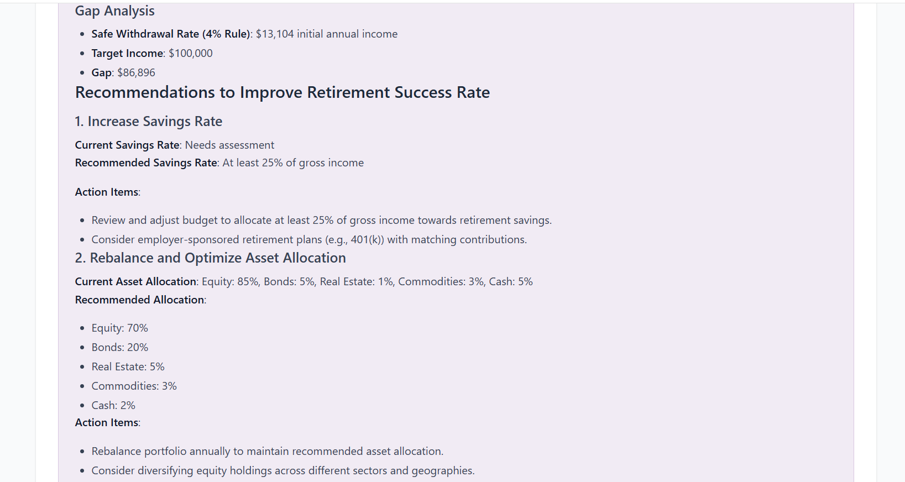
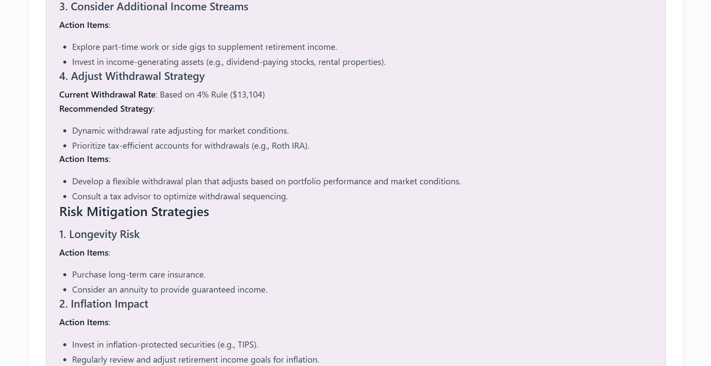
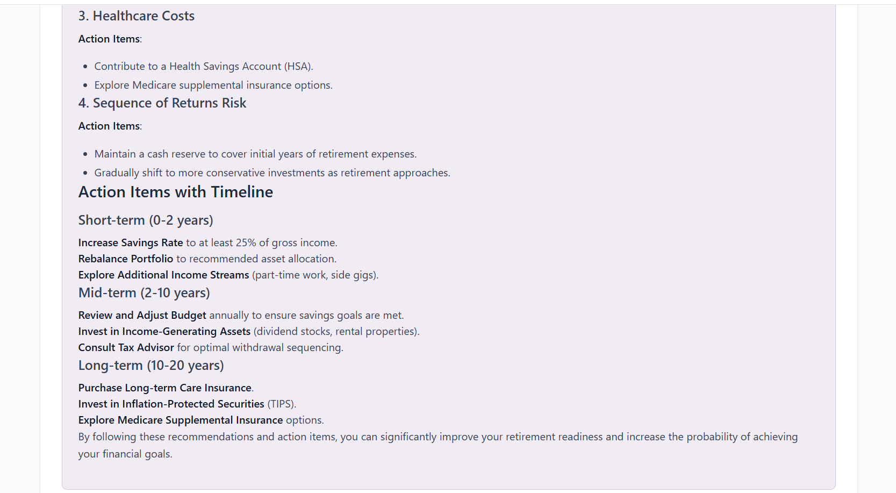

</details>

## Architecture

Alex uses a modern serverless architecture on AWS, combining AI services with cost-effective infrastructure:

```
┌─────────────────────────────────────────────────────────────────────────────┐
│                              USER INTERFACE                                  │
│                                                                             │
│    ┌─────────────┐      ┌─────────────┐      ┌─────────────────────────┐   │
│    │  Next.js    │      │  CloudFront │      │     Clerk Auth          │   │
│    │  Frontend   │ ───► │  CDN        │ ◄─── │     (User Management)   │   │
│    └─────────────┘      └─────────────┘      └─────────────────────────┘   │
└─────────────────────────────────────────────────────────────────────────────┘
                                    │
                                    ▼
┌─────────────────────────────────────────────────────────────────────────────┐
│                              API LAYER                                       │
│                                                                             │
│    ┌─────────────────┐      ┌─────────────────┐      ┌─────────────────┐   │
│    │  API Gateway    │ ───► │  Lambda (API)   │ ───► │  SQS Queue      │   │
│    │  (REST API)     │      │  FastAPI        │      │  (Orchestration)│   │
│    └─────────────────┘      └─────────────────┘      └─────────────────┘   │
└─────────────────────────────────────────────────────────────────────────────┘
                                    │
                                    ▼
┌─────────────────────────────────────────────────────────────────────────────┐
│                           AGENT ORCHESTRA                                    │
│                                                                             │
│    ┌─────────────┐    ┌─────────────┐    ┌─────────────┐    ┌───────────┐  │
│    │  Planner    │    │  Reporter   │    │  Charter    │    │ Retirement│  │
│    │  (Lambda)   │───►│  (Lambda)   │    │  (Lambda)   │    │ (Lambda)  │  │
│    │ Orchestrator│    │ Analysis    │    │ Visualize   │    │ Projections│ │
│    └─────────────┘    └─────────────┘    └─────────────┘    └───────────┘  │
│           │                                                                 │
│           ▼                                                                 │
│    ┌─────────────┐    ┌─────────────────────────────────────────────────┐  │
│    │  Tagger     │    │              Researcher (App Runner)             │  │
│    │  (Lambda)   │    │         Autonomous Market Intelligence           │  │
│    │ Classify    │    │              + MCP Web Browser                   │  │
│    └─────────────┘    └─────────────────────────────────────────────────┘  │
└─────────────────────────────────────────────────────────────────────────────┘
                                    │
                                    ▼
┌─────────────────────────────────────────────────────────────────────────────┐
│                           DATA & AI LAYER                                    │
│                                                                             │
│    ┌─────────────┐    ┌─────────────┐    ┌─────────────┐    ┌───────────┐  │
│    │  Aurora     │    │  S3 Vectors │    │  SageMaker  │    │  Bedrock  │  │
│    │  Serverless │    │  (90% cost  │    │  Embeddings │    │  Nova Pro │  │
│    │  PostgreSQL │    │   savings!) │    │  MiniLM-L6  │    │  LLM      │  │
│    └─────────────┘    └─────────────┘    └─────────────┘    └───────────┘  │
└─────────────────────────────────────────────────────────────────────────────┘
```

## Agent Collaboration

Alex orchestrates 6 specialized AI agents that collaborate to deliver comprehensive financial analysis:

| Agent | Role | Description |
|-------|------|-------------|
| **Planner** | Orchestrator | Coordinates all agents, manages workflow, compiles results |
| **Tagger** | Classifier | Categorizes instruments by asset class, region, and sector |
| **Reporter** | Analyst | Generates detailed portfolio narratives and recommendations |
| **Charter** | Visualizer | Creates allocation charts and visual data representations |
| **Retirement** | Projector | Runs Monte Carlo simulations for retirement planning |
| **Researcher** | Intelligence | Autonomously gathers market insights (runs every 2 hours) |

### Agent Communication Flow

```
User Request ──► SQS Queue ──► Planner (Orchestrator)
                                   │
                   ┌───────────────┼───────────────┐
                   │               │               │
                   ▼               ▼               ▼
              Reporter        Charter        Retirement
                   │               │               │
                   └───────────────┴───────────────┘
                                   │
                                   ▼
                            Database (Results)
```

## Tech Stack

| Category | Technology |
|----------|------------|
| **Frontend** | Next.js 15, React, TailwindCSS, Recharts |
| **Authentication** | Clerk |
| **Backend** | FastAPI, Python 3.12 |
| **AI/ML** | AWS Bedrock (Nova Pro), OpenAI Agents SDK, LiteLLM |
| **Embeddings** | SageMaker Serverless (all-MiniLM-L6-v2) |
| **Vector Storage** | S3 Vectors |
| **Database** | Aurora Serverless v2 (PostgreSQL) |
| **Compute** | AWS Lambda, App Runner |
| **Infrastructure** | Terraform, Docker |
| **CDN** | CloudFront |

## Project Structure

```
alex/
├── backend/                 # Agent code and Lambda functions
│   ├── api/                 # FastAPI backend for frontend
│   ├── planner/             # Orchestrator agent
│   ├── tagger/              # Instrument classification agent
│   ├── reporter/            # Portfolio analysis agent
│   ├── charter/             # Visualization agent
│   ├── retirement/          # Retirement projection agent
│   ├── researcher/          # Market research agent (App Runner)
│   ├── ingest/              # Document ingestion Lambda
│   └── database/            # Shared database library
│
├── frontend/                # Next.js React application
│   ├── pages/               # Next.js pages (Pages Router)
│   ├── components/          # React components
│   └── lib/                 # Utility functions
│
├── terraform/               # Infrastructure as Code
│   ├── 2_sagemaker/         # SageMaker embedding endpoint
│   ├── 3_ingestion/         # S3 Vectors and ingest Lambda
│   ├── 4_researcher/        # App Runner research service
│   ├── 5_database/          # Aurora Serverless v2
│   ├── 6_agents/            # Multi-agent Lambda functions
│   ├── 7_frontend/          # CloudFront, S3, API Gateway
│   └── 8_enterprise/        # Monitoring and dashboards
│
├── scripts/                 # Deployment scripts
│   ├── deploy.py            # Full deployment script
│   ├── run_local.py         # Local development
│   └── destroy.py           # Cleanup script
│
└── guides/                  # Step-by-step deployment guides
```

## Prerequisites

- **AWS Account** with IAM user configured (`aws configure`)
- **Docker Desktop** (for Lambda packaging)
- **Node.js 18+** and npm
- **Python 3.12** with [uv](https://docs.astral.sh/uv/) package manager
- **Terraform** 1.0+
- **Clerk Account** (for authentication)

## Quick Start

### 1. Clone and Configure

```bash
git clone https://github.com/CyprianFusi/agentic-financial-assist.git 
cd agentic-financial-assist
```

### 2. Set Up AWS Permissions

Follow the guide in `guides/1_permissions.md` to configure IAM policies.

### 3. Deploy Infrastructure

Each terraform directory is independent. Deploy in order:

```bash
# Deploy each component
cd terraform/2_sagemaker && terraform init && terraform apply
cd terraform/3_ingestion && terraform init && terraform apply
cd terraform/4_researcher && terraform init && terraform apply
cd terraform/5_database && terraform init && terraform apply
cd terraform/6_agents && terraform init && terraform apply
cd terraform/7_frontend && terraform init && terraform apply
```

### 4. Deploy Frontend

```bash
cd scripts
uv run deploy.py
```

### 5. Access Your Application

After deployment, the script will output your CloudFront URL where Alex is live.

## Cost Optimization

Alex is designed for cost efficiency using serverless and pay-per-use services:

| Component | Monthly Cost | Notes |
|-----------|-------------|-------|
| S3 Vectors | ~$30 | 90% cheaper than OpenSearch |
| Aurora Serverless | ~$50 | Scales to zero when idle |
| SageMaker Serverless | ~$5-10 | Pay per embedding request |
| Lambda | ~$1-5 | Pay per invocation |
| App Runner | ~$5 | Minimal baseline |
| CloudFront + S3 | ~$1 | Static hosting |
| **Total** | **~$90-100** | Can be reduced by destroying when not in use |

**Cost Saving Tip**: Run `terraform destroy` in `terraform/5_database` when not actively developing to avoid Aurora charges.

## Local Development

```bash
# Run the API locally
cd backend/api
uv run uvicorn main:app --reload

# Run the frontend locally
cd frontend
npm install
npm run dev
```

## Cleanup

To destroy all resources:

```bash
cd scripts
uv run destroy.py
```

Or destroy each terraform directory in reverse order:

```bash
cd terraform/7_frontend && terraform destroy
cd terraform/6_agents && terraform destroy
cd terraform/5_database && terraform destroy
# ... continue for remaining directories
```

## Acknowledgments

This project was built as part of the **"AI in Production"** course by [Ed Donner](https://www.udemy.com/user/ed-donner/) on Udemy, demonstrating enterprise-grade AI agent deployment on AWS.

## License

MIT License - see [LICENSE](LICENSE) for details.

---

<div align="center">
  <sub>Built with AWS Serverless, OpenAI Agents SDK, and Next.js</sub>
</div>
